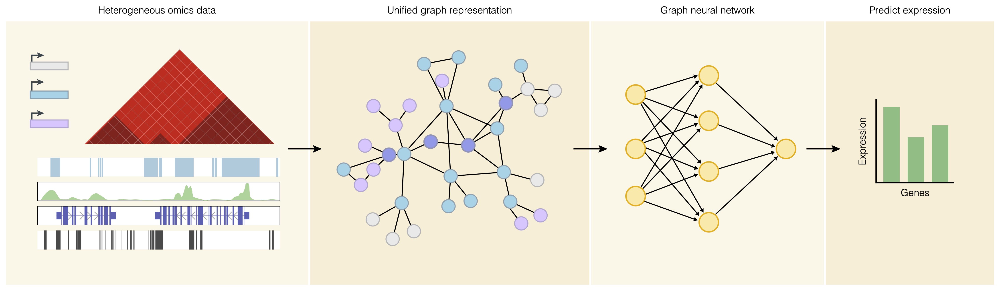

# Omics Graph Learning
Tools to construct graphs heterogenous multi-omics data and train a GNN to regress values of gene expression and protein abundance. Graphs are mutagenized to query the impact of individual features on biological function.

<div align="center">
    
</div>

## Overview
Lorem Ipsum.  
<br>
## Installation

```sh
$ git clone https://github.com/sciencesteveho/genomic_graph_mutagenesis.git
```

To set up an environment, use `pip install -r requirements.txt`. Using a conda environment is highly recommended. <br>
<br>
Additionally, OGL uses peakMerge.py from ReMap2022 (Hammal et al., *Nucleic Acids Research*, 2021) to call tissue-specific cis-regulatory modules from epimap data. Download the script and place its path in the configuration file.
```sh
wget https://raw.githubusercontent.com/remap-cisreg/peakMerge/main/peakMerge.py
```
<br>

## Usage
OGC is designed to run end to end on a computing cluster. Set-up your configs according to those in `omics_graph_creation/configs` and run your experiment with a single command.   
Example SLURM scripts can be found in `/examples/slurm`.

*Note: not all arguments are compatible with one another, so see examples below for the program's capabilities.*
```sh
yaml=/ocean/projects/bio210019p/stevesho/data/preprocess/omics_graph_learning/configs/experiments/$config
partition=RM
python ogl.py \
    --experiment_yaml $yaml \
    --partition $partition \
    --model "GraphSAGE" \
    --target "rna_seq" \
    --tpm_filter 1 \
    --percent_of_samples_filter 0.2 \
    --gnn_layers 2 \
    --linear_layers 3 \
    --activation "relu" \
    --dimensions 512 \
    --epochs 100 \
    --learning_rate 0.0001 \
    --optimizer "Adam" \
    --batch_size 256 \
    --dropout 0.1 \
    --graph_type "full" \
    --rna
```
<br>

## Directory Structure
### Working Directory
OGL's directory structures will be made from the main directory you place it, `path/to/graph_processing`.

To start, users must create the following directory ```shared_data/``` and subdirectories to place their raw data.

### Shared Data
* `graph_processing/shared_data/...`
    * `local/`: genome static bedfiles
    * `regulatory_elements/`: regulatory element catalogues
    * `references/`: bedfiles that provide coordinates for node types
    * `interaction/`: interaction type data
    * `targets/`: training target GCT files and matrices <br>
    ** `targets/expression`: expression targets for cell lines <br>
    ** `targets/matrices`: protein targets and all-tissue gcts <br>
    ** `targets/tpm`: individual gcts per tissue <br>

### Raw Data
* `graph_processing/raw_tissue_data/...`

<br>
The following directories will be made automatically during the pipeline.

### Graph Construction
* `graph_processing/*experiment_name*/...`
    * `*experiment_name*/tissue/`: directories for sample parsing
    * `*experiment_name*/graphs/`: individual tissue level graphs
    * `*experiment_name*/graphs/*target_name*/`: concatenated graphs filtered by training set

### Models
* `graph_processing/models/...`
    * `*experiment_name*`: model checkpoints
    * `*experiment_name*/logs/`: training loss logs as well as tensorboard logs
    * `*experiment_name*/plots/`: plots of training loss and model performance on testing set  
<br>
<br>

### Preprocessing
Given the large amount of multimodal data, some files required preprocessing before input into the OGC pipeline.

Much of the pre-processing is done with the script preparse.sh
```
bash preparse.sh --inputs
```
To prepare the regulatory element sequence similarity graph, we ran the following command using 18 cores (16 for processing, 2 for overhead).
```
python omics_graph_learning/auxiliary_graphs/sequence_similarity_graph.py \
    --chrom_sizes /ocean/projects/bio210019p/stevesho/resources/hg38.chrom.sizes.autosomes.txt \
    --reg_elements /ocean/projects/bio210019p/stevesho/data/preprocess/shared_data/regulatory_elements/concatenated_overlapped_elements.bed \
    --fasta /ocean/projects/bio210019p/stevesho/resources/hg38.fa \
    --savedir /ocean/projects/bio210019p/stevesho/data/preprocess/sequence_similarity_graph \
    --open_gap_score $score
```
To prepare the gene ontology graph, we ran the following command:
```
python omics_graph_learning/auxiliary_graphs/go_ontoloy_graph.py \
    --working_dir /ocean/projects/bio210019p/stevesho/data/preprocess/auxiliary_graphs/go \
    --mapfile go_ids_to_gene_symbol.txt \
    --go_gaf goa_human.gaf \
    --gencode_ref /ocean/projects/bio210019p/stevesho/data/preprocess/shared_data/local/gencode_v26_genes_only_with_GTEx_targets.bed
```

## Model Overview
### Tissue-specific models
Base interactions are derived tissue-specific chromatin loops, which is then combined with the interaction type graphs to creates the base nodes.
The following chromatin loop interactions are parsed:
```
*gene TSS - reg element interactions require one anchor to overlap the element, and the other anchor to be within 2kb of a TSS
gene TSS - gene TSS
gene TSS - distal enhancer
gene TSS - promoter
gene TSS - dyadic element
gene TSS - super enhancer

element to element interactions require that both elements directly overlap opposing anchors
promoter - distal enhancer
promoter - dyadic element
promoter - super enhancer
```

There are 14 node types, 4 edge types, and each node has a 36-dimensional feature vector.
Each training target is a 4-dimensional feature vector.

```
The following features have node representations:
    Tissue-specific
        Genes (GENCODE, PPI interactions from IID)
        TFs (Marbach, TFMarker)
        MicroRNAs (mirDIP for tissue-specific, miRTarBase for interactions)
        Cis-regulatory modules (peakMerge against epimap narrow peaks)
        Transcription factor binding sites (Vierstra et al., Nature, 2020)
        TADs
        Super-enhancers (sedb)

    Genome-static
        Cpgislands
        Gencode (genes)
        Promoters (overlap between encode cCREs and epimap)
        Enhancers (overlap between encode cCREs and epimap)
        Dyadic elements (overlap between encode cCREs and epimap)
        CTCF-cCRE (encode cCRE)
        Transcription start sites

The following are represented as attributes:
    Tissue-specific
        CpG methylation

        Peak calls
            DNase
            ATAC-seq
            CTCF
            H3K27ac
            H3K27me3
            H3K36me3
            H3K4me1
            H3K4me2
            H3K4me3
            H3K79me2
            H3K9ac
            H3K9me3
            POLR2A
            RAD21
            SMC3

    Genome-static
        GC content
        Microsatellites
        Conservation (phastcons)
        Poly(a) binding sites (overlap)
        LINEs (overlap)
        Long terminal repeats (overlap)
        Simple repeats (overlap)
        SINEs (overlap)
        Hotspots
            snps
            indels
            cnvs 
        miRNA target sites
        RNA binding protein binding sites
        Replication phase
            g1b
            g2
            s1
            s3
            s4
            s4
        Recombination rate (averaged)
```
<br>

Our models include a variety of tissues and cells lines as indicated below:
#### Tissues
```
Hippocampus
Left ventricle
Liver
Lung
Mammary
Pancreas
Skeletal muscle
Skin
Small intestine
```
#### Cell type models
```
H1-hESC
12878
HeLa
K562
Neural progenitor cell
```
*Note - GM12787 and H1-hESC do not have multiple epimap tracks, so instead of concatenated and averaging their bedgraphs, only one input is used for these samples.*
<br>

### Universal Genome
The universal genome annotation borrows the core ideas from the tissue-specific models but utilizes data sources that represent large-scale data collected from multiple genomes. Additionally, the universal genome model has an additional node type, DNAse-hypersensitivty sites.

There are 15 node types, 4 edge types, and each node has a 779-dimensional feature vector. Each training target is a 120-dimensional feature vector.

```
Chromatin loops are variable chromatin loops derived from Grubert at al.
DHS nodes are all 3.59 million DNase I sites from Meuleman et al., Nature, 2020.

Protein-protein interactions come from the human_only set from the Integrated Interactions Database.
TF-Gene interactions are the combinded top 20% interactions across 24 models from Marbach et al.

MicroRNAs are the entirety of miRTarBase interactions without tissue-specific filtering with mirDIP.
Cis-regulatory are modules Homo Sapiens CRMs from ReMap2022.
Transcription factor binding sites come from (Vierstra et al., Nature, 2020)
TADs are the scaffolds from TadMap by Singh and Berger, 2021.
Super-enhancers are all human super enhancers from the SEdb.

Genome-static nodes are kept as they are in tissue-specific models
CpG methlylation is represented as a 37n vector, each representing a different reference genome derived from the roadmap project. CpGs are merged.
Epigenetic are represented as a 722n vector, where each track is the average signal in a different tissue.
```
<br>