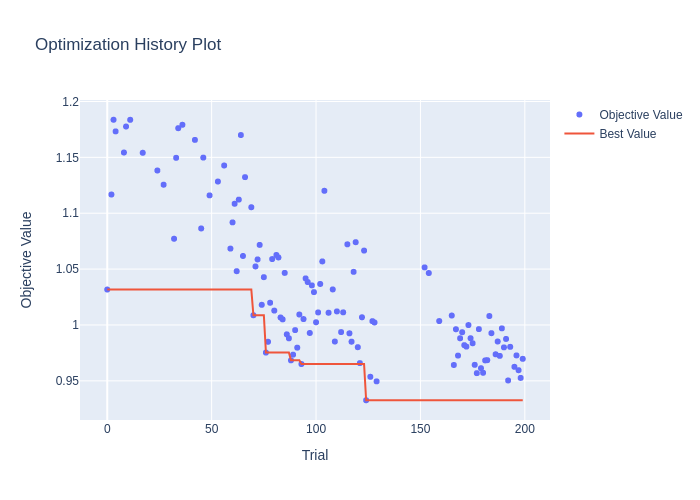
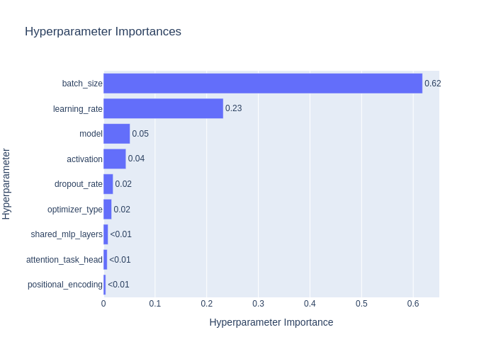
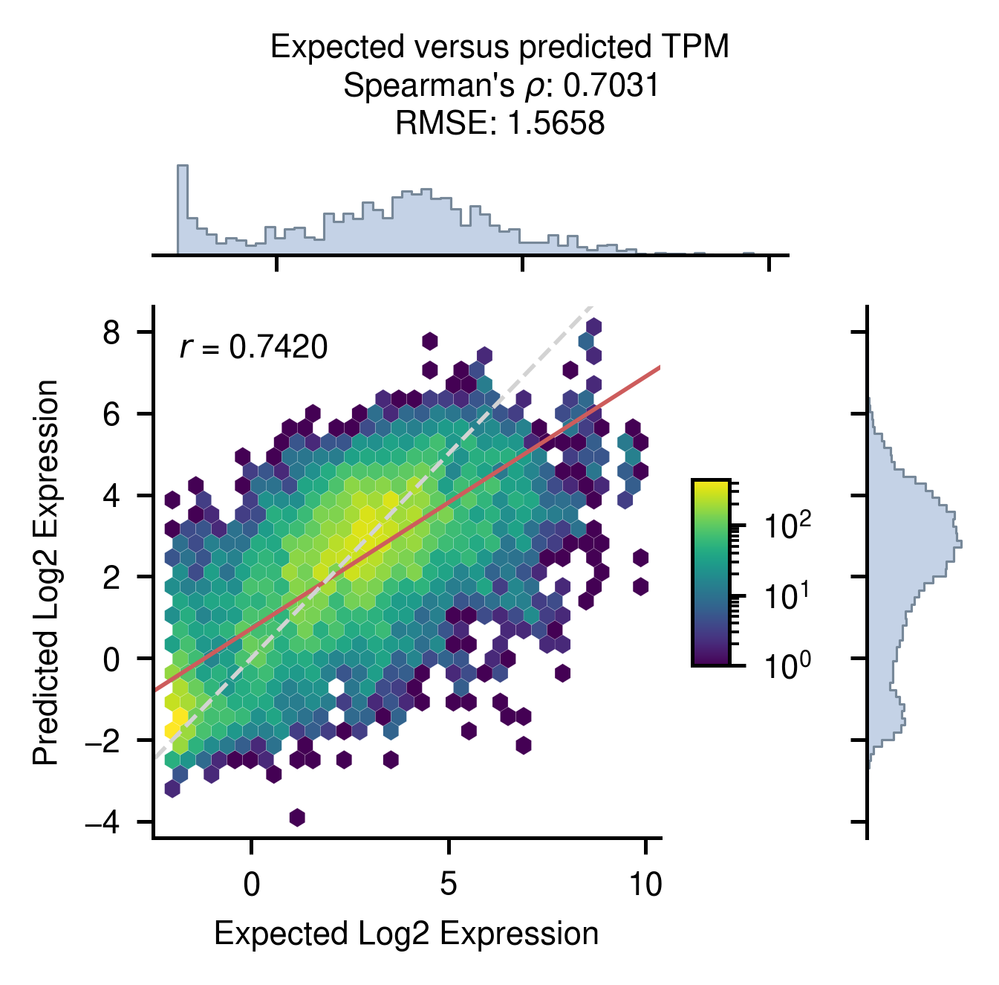
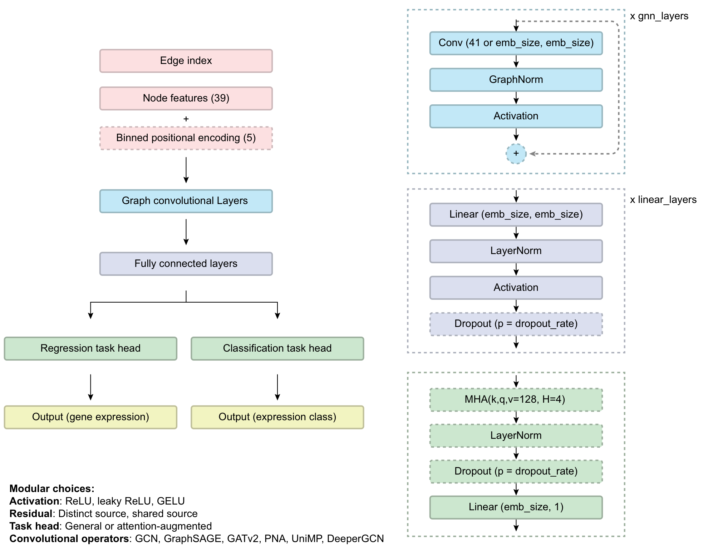
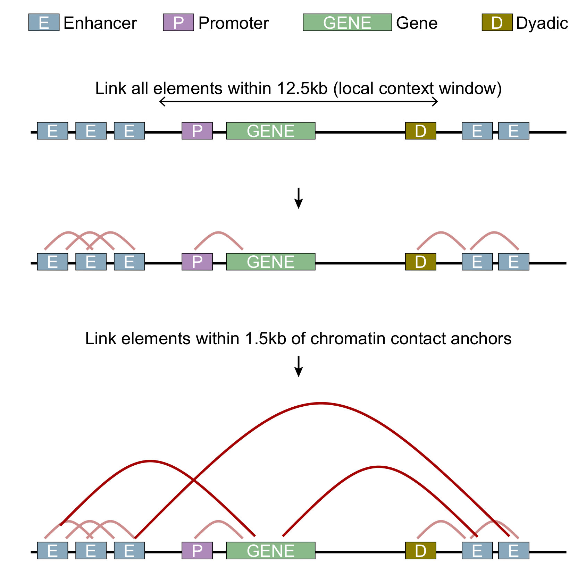

# Omics Graph Learning 

## Tools to construct, train, optimize, and interpret omics-based GNNs
<div align="center">
    
</div>
<br>

## Overview
Omics Graph Learning (OGL) is a fully integrated pipeline revolving around the construction of multi-modal, heterogenous graphs from omics data. Modules for all of the following are included:
1. Discretionary data pre-processing
2. Programmatic data download
3. Graph construction from tissue-specific datasets
4. Chromosome splitting and target assemblage
5. Node feature aggregation and scaling
6. Modular and flexible GNN architecture
7. Modular and flexible model training
8. Integrated hyperparameter optimization
9. Interpretibility and perturbation experiments
10. Built-in reproducibility measures

<br>

## Installation
OGL is currently available as source code. Install it via:

```sh
$ git clone https://github.com/sciencesteveho/omics_graph_learning.git
```

Using a conda environment is highly recommended with `Python == 3.9.16`. Use `pip install -r requirements.txt` to install dependencies.  <br>

<br>

## Directory Structure

<details>
<summary>Expand details on directory structure</summary>

### Working Directory
OGL's directory structures will be made from the main directory you place it, `path/to/graph_processing`. <br>
To start, users must create the following directory ```shared_data/``` and subdirectories to place their raw data.

### Shared Data
* `graph_processing/shared_data/...`
    * `local/`: genome static bedfiles
    * `regulatory_elements/`: regulatory element catalogues
    * `references/`: bedfiles that provide coordinates for node types
    * `interaction/`: interaction type data
    * `processed_loops/`: processed and formatted 3D chromatin data
    * `targets/`: training target GCT files and matrices <br>
    ** `targets/expression`: expression targets for cell lines <br>
    ** `targets/matrices`: protein targets and all-tissue gcts <br>
    ** `targets/tpm`: individual gcts per tissue <br>

### Raw Data
* `graph_processing/raw_tissue_data/...`

<br>
Quickly create the required directory structure with the following:

<details open><summary>Bash loop to make directories</summary>

```sh
# directories to create
DIRS=(
    "$ROOT_DIR/graph_processing/shared_data/local"
    "$ROOT_DIR/graph_processing/shared_data/regulatory_elements"
    "$ROOT_DIR/graph_processing/shared_data/references"
    "$ROOT_DIR/graph_processing/shared_data/interaction"
    "$ROOT_DIR/graph_processing/shared_data/processed_loops"
    "$ROOT_DIR/graph_processing/shared_data/targets/expression"
    "$ROOT_DIR/graph_processing/shared_data/targets/matrices"
    "$ROOT_DIR/graph_processing/shared_data/targets/tpm"
    "$ROOT_DIR/graph_processing/raw_tissue_data"
)

# make each each directory
for DIR in "${DIRS[@]}"; do
    mkdir -p "$DIR"; then
done
```
</details>

<br>
The following directories will be made automatically during the pipeline.

### Graph Construction
* `graph_processing/experiments/*experiment_name*/...`
    * `*experiment_name*/tissue/`: directories for sample parsing
    * `*experiment_name*/graphs/`: individual tissue level graphs
    * `*experiment_name*/graphs/*target_name*/`: concatenated graphs filtered by training set

### Models
* `graph_processing/models/...`
    * `run_*number*`: model checkpoints, plots, and metrics
    * `tensorboard/`: tensorboard events logging

</details>

<br>

## Preprocessing
Given the large amount of multimodal data many files require preprocessing before input into OGL. Complete pre-processing scripts are provided.

`discretionary_preprocessing/` provides examples scripts for the processing of raw 3D chromatin data. <br>
`programmatic_data_download/` provides scripts that automate the download and pre-processing for most necessary parts of the pipeline.
<br>
<br>

## Usage and Examples
OGL is designed to run end to end on a computing cluster and requires:
1. An experiment and sample configs. Detailed information is provided in [configs](docs/configs.md).
2. Job submission scripts adjusted for your computing environment. `ogl_pipeline.py` assumes a slurm cluster. The script will need to be adjusted if running in other environments. Example SLURM scripts can be found in `/examples/slurm`.

<br>

### Required Argument(s)

| Argument                    | Type    | Default                 | Choices                                       | Description                                                                                                                          |
|-----------------------------|---------|-------------------------|-----------------------------------------------|--------------------------------------------------------------------------------------------------------------------------------------|                            
| `--experiment_yaml`         | `str`   | _Required_              | N/A                                           | Path to the experiment YAML file.                                                                                                   |                                                       |

Users can run OGL to two separate endpoints. <br>
1. Endpoint (1) takes the pipeline to hyperparameter optimization, where a model is not trained but parameters for a performant model are provided through successive pruning.
2. Endpoint (2) takes the pipeline to a trained GNN. Trained GNNs automatically run for 3 separate random seeds and their metrics include median performance and a 95% confidence interval. Single runs can be specified using the `--run_number` argument.

<br>

### Example use case: run pipeline from start to hyperparameter optimization (endpoint 1)
<details open>
  <summary> Hyperparameter optimization on a K562 model </summary>

<br>

Running the following command will submit a series of jobs that takes the pipeline through pre-processing, node and edge generation, graph construction, target assemblage, feature scaling, and run 200 optuna trials, culminating in hyperparameter optimization and a neural architecture search.

```sh
python ogl/omics_graph_learning/ogl_pipeline.py \
  --partition RM \
  --experiment_yaml ogl/configs/experiments/k562_deeploop_300K.yaml \
  --target rna_seq \
  --optimize_params \
  --n_gpus 20
```

Trial history, feature importance, and slice plots will be output, as well as `optuna_results.csv` which contains trial history sorted by performance.
<div align="left">
    
</div>
<div align="left">
    
</div>


</details>

<br>

### Example use case: run pipeline from start to a trained GNN of a specific architecture (endpoint 2)

<details open>
  <summary> Training a "hippocampus" GNN model </summary>

<br>

Running the following command will submit a series of jobs that takes the pipeline through pre-processing, node and edge generation, graph construction, target assemblage, feature scaling, and culminate in training three GNN models on independent seeds.

```sh
  sample="hippocampus"
  config=("${sample}_allcontacts_global.yaml")
  python ogl/omics_graph_learning/ogl_pipeline.py \
    --partition RM \
    --experiment_yaml ogl/configs/experiments/"${config}" \
    --target rna_seq \
    --model GAT \
    --gnn_layers 2 \
    --linear_layers 2 \
    --activation gelu \
    --dimensions 200 \
    --batch_size 64 \
    --learning_rate 0.0005 \
    --optimizer AdamW \
    --scheduler cosine \
    --dropout 0.3 \
    --residual distinct_source \
    --heads 2 \
    --positional_encoding \
    --model_name regulatory_${sample}_allcontacts
```
Each run (1-3) will produce multiple files logging the metadata, architecture, and training. Of pertinence:
  - `final_model.pt`: model checkpoint saved at the end of training
  - `best_model.pt`: model checkpoint saved if early stopping is triggered
  - `eval_metrics.json`: performance metrics for the trained model
  - `performance.png`: an expected vs predicted plot of model performance

### eval_metrics.json
```sh
{
    "Final test loss": 1.432008501180574,
    "Final test pearson": 0.711228820220772,
    "Final test RMSE": 1.6783552169799805,
    "Final test accuracy": 0.900551438331604,
    "Bootstrap pearson": 0.7113068023714024,
    "CI lower": 0.7110652918637272,
    "CI upper": 0.7115483128790776
}
```
### performance.png
<div align="left">
    
</div>

</details>

<br>

*Note: for more details on usage, see [arguments](docs/arguments.md)*.

<br>


## Model Overview
### Modularity and flexible
OGL adopts a GNN "solution space" as opposed to hard architecture. The models are highly flexible and part of the neural architecture search is performed in tandem with hyperparameter optimization. Some flexible components include gnn operators, training scheduler, training optimizer, activation function, residual connection type, and more. See [arguments](docs/arguments.md).

<details>
<summary>Flexible architecture schematic</summary>

<div align="left">
    
</div>

</details>


### Graph construction
Graphs are constructed using knowledge-graph inspired representations: nodes represent genes, regulatory elements, and TADs, connected via chromatin loops (distal) or linear proximity.

<details>
<summary>Graph construction schematic</summary>

<div align="left">
    
</div>

</details>

### Node features

Each node is accompanied by either a 39 or 44-dimensional feature vector consisting of an optional binned positional encoding and a mix of static and tissue-specific data tracks. See the associated paper's supplementary materials for more information.

<br>

## Citation
An associated preprint is coming soon.

```bibtex
@misc{Ho/Mills/2025,
  author       = {Ho, Steve and Mills, Ryan E.},
  title        = {A Graph Neural Network Approach to Interpret Expression},
  year         = {2025},
  note         = {Pre-release version},
}